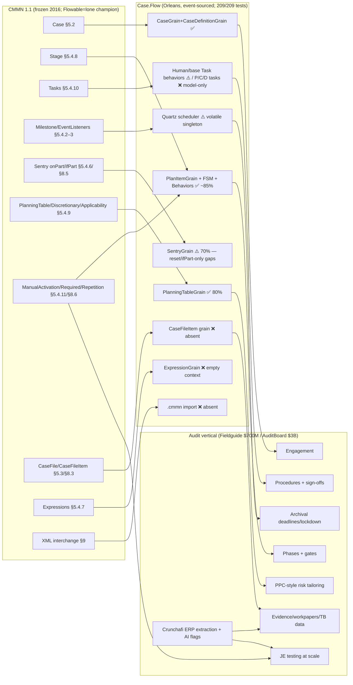

# Commercial Readiness Deep-Dive

*Produced 2026-07-06 via orchestrated multi-agent analysis: 3 spec-adherence auditors (each reading assigned pages of `formal-16-12-01.pdf` against the code), an architecture mapper, an engineering-quality reviewer, a build/test verifier, a docs auditor, and 2 web-research agents (audit domain, CMMN market) — aggregated and adjudicated by a primary reasoner with direct spec verification of contested findings. Code structure cross-checked against a GitNexus knowledge graph (2,194 nodes / 5,400 edges / 68 clusters / 54 flows).*

---

## 1. Executive Summary

**Case.Flow is a well-architected, half-finished CMMN 1.1 engine whose strong half is the half the audit market needs.** The control plane — plan-item state machines, sentry AND-logic, stage cascades, repetition spawning, and (uniquely) planning tables with applicability rules — is ~80–85% spec-adherent and covered by a healthy test suite (209/209 passing). The data plane — case file, expression context, parameter flow — is ~15% complete and mostly dead code, which silently disables every data-driven behavior rule. There is no CMMN XML import/export *feature* today — so no formal OMG conformance class can be claimed yet — but the XSD-generated model layer is XmlSerializer-ready and the runtime consumes its IDREF strings directly, so a structural importer is a thin adapter rather than a project (§2.4).

**Strategic verdict (evidence-based): finish it as a CMMN-*powered* audit engagement platform, not as a CMMN-*branded* horizontal engine.** The standard is frozen (v1.1, Dec 2016) and publicly abandoned by Camunda, with Flowable as the lone active champion — but the audit vertical is booming (Fieldguide $700M valuation, AuditBoard $3B exit, DataSnipper $1B), buys workflow at high multiples, and uses no standards at all. Critically, Thomson Reuters PPC's SMART Practice Aids mechanism — risk-assessment answers auto-generating tailored audit programs — is structurally identical to CMMN's planning table + applicability rules + discretionary items, which is exactly the part of the spec Case.Flow implemented. Crunchafi's ERP-extraction + AI-analysis assets supply the differentiation the workflow engine alone cannot.

**Rough path to pilot-ready: 4 phases, ~24–38 engineering weeks** (§8). The existing `docs/03-modernization-plan.md` covers Phase 0 well but the business case's "engine is substantially complete" premise holds only for the control plane; the data plane, production infrastructure, and audit-specific layer are real, unbudgeted work.

---

## 2. Spec Adherence Assessment

### 2.1 Conformance status (spec §2)

| Conformance class | Requires | Status |
|---|---|---|
| Case Modeling Conformance | §5 metamodel + §9 XML interchange | ❌ blocked — no `.cmmn` import/export, `Definitions` root never used |
| CMMN Complete Conformance | §5 + §6 + §8 + §9 | ❌ blocked — same, plus notation N/A (runtime only) |
| Marketing claim available today | — | "Implements CMMN 1.1 execution semantics for the case plan model" (with documented deviations); **not** "CMMN 1.1 compliant" |

The XSD-generated metamodel (`Spec.CMMN.MODEL.cs`, generated from the official OMG XSD) ironically contains 100% of §5 as data classes — including `Definitions`, `Import`, and all task types — but the engine bypasses the `Definitions` root entirely; case definitions are authored only through the proprietary grain API.

### 2.2 Adherence scorecard (by spec area)

| Area | Spec | Score | Basis |
|---|---|---|---|
| Plan-item state machines (all 3 lifecycles) | §8.4 | **~85%** | State sets and transition tables match Tables 8.5–8.11 almost exactly (`PlanItemStateMachine.cs:49–201`); deviations listed in §2.3 |
| Stage cascades (parentSuspend/Resume/Terminate/exit) | §8.4.2 | **~90%** | Correct propagation incl. terminal-child skipping and `ParentSuspendState` history restore |
| Sentry mechanics | §5.4.6, §8.5 | **~70%** | AND-semantics + per-onPart tracking correct; ifPart-only sentries, `sentryRef` mode, and repetition reset missing |
| Behavior property rules | §5.4.11, §8.6 | **~75%** | ManualActivation default TRUE **verified correct** (Table 5.51); repetition first-eval-discard and repeat-on-complete deviations |
| Planning table / discretionary items | §5.4.9, §8.6.5, §8.7 | **~80%** | `PlanningTableGrain.GetPlannableItems` + applicability rules genuinely implemented; role authorization on TableItems not enforced |
| Case file & CaseFileItem lifecycle | §5.3, §8.3 | **~10%** | Model classes + transition-event enum only; no grain, no lifecycle, no operations; nothing publishes case-file events |
| Expressions | §5.4.7 | **~15%** | Jint evaluation works, but context injection is commented-out TODO (`ExpressionGrain.cs:68–95`) — all data-referencing expressions evaluate against an empty JS context; no language dispatch, no XPath |
| Task types | §5.4.10 | **~40%** | HumanTask/base Task lifecycles work; `performerRef` not enforced; `isBlocking=false` unimplemented; **ProcessTask/CaseTask/DecisionTask are model-only (no behaviors, no invocation)** |
| Parameters / data flow | §5.4.10.1–3 | **0%** | Model-only; no binding, no mappings executed |
| Roles | §5.2.2 | **~50%** | RoleGrain + UserEventListener authorization work; task/planning authorization not enforced |
| XML interchange | §9 | **0% shipped; model layer ready** | No import/export pipeline exists, but the groundwork is deliberate — see §2.4 |

**Weighted overall: ~60–65% of the spec surface — but the distribution is the story: control plane strong, data plane absent.** GitNexus quantifies the same skew: `Behaviors` cluster = 169 symbols; `Expressions` cluster = 2.

### 2.3 Confirmed deviations (adjudicated, with false positives removed)

Two findings initially flagged as critical were **overturned by direct spec reading** and are *not* bugs:
- *ManualActivationRule default*: Table 5.51 (spec p. 52) says absence ⇒ "considered TRUE". `BaseBehavior.cs:152` matches. (Note for product: Flowable inverts this pragmatically; keep an engine option in mind.)
- *EventListener ignoring sentries*: EventListeners may not carry item-control rules (Table 5.51) and act as event sources, not sentry-triggered items; the no-op handler is fine.

Real deviations, by severity:

| # | Sev | Deviation | Spec | Evidence |
|---|---|---|---|---|
| D1 | CRIT | Expression context never injected — ifParts/rules referencing case data silently evaluate as `undefined` → defaults | §5.4.6.4, §5.4.7 | `ExpressionGrain.cs:68–95` (commented-out TODO) |
| D2 | CRIT | No CaseFileItem grain/lifecycle; `CaseFileItemOnPart` sentries can never fire (nothing publishes the events) | §5.3.2, §8.3 | `SentryGrain.cs:75–87`; no `CaseFileItemGrain` exists |
| D3 | CRIT | IfPart-only sentries never evaluate (no subscription path exists for them) | §8.5 | `SentryGrain.cs:62–87` |
| D4 | CRIT | Stage completion for `autoComplete=false` conflates Table 8.12's OR-branches: non-required active children wrongly block manual completion; `PlanningTable == null` used as "no discretionary items" | §8.6.1 | `StageBehavior.cs:343–358` |
| D5 | MAJ | Sentry state never resets between repetitions (`Satisfied`/`OccurredOnParts` persist; spurious re-fire on reactivation) | §8.6.4 | `SentryStore.cs:12–27` |
| D6 | MAJ | Stage never subscribes its exit criteria on the create path (tasks do) — stages can miss exit events until a deactivate/reactivate cycle | §8.5 | `StageBehavior.cs:100–121` vs `TaskBehavior.cs:79`; TODO at `StageBehavior.cs:17` |
| D7 | MAJ | RepetitionRule first evaluation persisted instead of discarded; no re-evaluation on complete/terminate for no-entry-criteria items | §8.6.4, §5.4.11.3 | `BaseBehavior.cs:196–204`, `PlanItemStore.cs:84–88` |
| D8 | MAJ | `CasePlanModelBehavior` is a `// TODO!` stub — no case-specific close/reactivate handling, no Closed-state immutability | §8.4.1 | `CasePlanModelBehavior.cs:13` |
| D9 | MAJ | ProcessTask / CaseTask / DecisionTask have no runtime behaviors (silently degrade or fail if modeled) | §5.4.10.5–7 | `PlanItemBehaviorConfiguratorService.cs` dispatch table |
| D10 | MIN | `PlanItemOnPart.sentryRef` trigger mode unimplemented; ifPart errors swallowed without fault; no expression-language dispatch | §8.5, §5.4.7 | `SentryGrain.cs:94–103,161–163` |

### 2.4 Correction (2026-07-06): the XML interchange gap is smaller than first scored

Pushback during review prompted re-verification, and the original "MISSING / top gap" framing overweighted this item. Verified facts:

- `Spec.CMMN.MODEL.cs` is generated by XmlSchemaClassGenerator from the official OMG XSD **with full `System.Xml.Serialization` attributes**: `XmlRoot` per element, `XmlInclude` covering the entire substitution-group hierarchy (all task types, onPart variants, criteria — lines 138–164), and ref attributes typed exactly as the XSD dictates (`DataType="IDREF"`/`"IDREFS"`/`"QName"`).
- **The runtime consumes those IDREF strings as-is** — no object-reference pre-wiring is needed: criteria subscriptions key on `criterion.SentryRef` (`BaseBehavior.cs:58,117,128`), sentry matching compares `x.SentryRef == @event.SourceDefinitionId` (`StageBehavior.cs:138`, `TaskBehavior.cs:159`, `MilestoneBehavior.cs:62`), and plan items resolve `definition.DefinitionRef` through the address-indexed definition lookup (`PlanItemGrain.cs:83`, `CaseDefinitionGrain.cs:70–89`).
- `CaseDefinitionGrain.Define(Case)` walks exactly the object shape `XmlSerializer` produces (`CasePlanModel` → `PlanItemDefinitions` recursion).

**Consequence:** a structural importer is `XmlSerializer.Deserialize<Definitions>` → per-`Case` → `Define(case)` — an adapter measured in days including tests, not a workstream. What keeps *interchange* (the point of §9) from being fully trivial:

1. **Executable ≠ structural.** Modeler-authored `.cmmn` carries expressions in XPath (spec default), FEEL, or JUEL; the engine ignores `Expression.Language` and routes everything to Jint with an empty context (D1/D10). Structure imports; conditions won't evaluate as authored until the Phase 1 expression work lands.
2. **Silent degradation needs a lint.** The deserializer will happily accept CaseFileItemOnParts, ProcessTask/CaseTask/DecisionTask, and parameter mappings — all runtime no-ops today (D2/D9). Import without a capability-validation pass turns documented gaps into silent runtime surprises; the validator is small but mandatory.
3. **`Definitions`-scope references.** The engine bypasses the `Definitions` root, where QName refs (caseFileItem `definitionRef`, `processRef`/`decisionRef`/`caseRef`, the `expressionLanguage` default) resolve. The importer must persist that context or knowingly drop it.
4. **Export** is plausible with the same attributes but should be proven by golden-file round-trips against Trisotech/Flowable samples before being claimed.

Conformance implication unchanged (no class claimable until the feature plus §5/§8 semantics exist), but roadmap-wise a structural import + capability lint is a **~1-week Phase 1 add-on**, not a blocker.

---

## 3. Engineering Quality Assessment

**Verdict: EVOLVE, do not rewrite.** The CMMN→virtual-actor mapping (grain per case/plan-item/sentry, behavior composition over a Stateless FSM, event-sourced stores with pure `Apply` projections, spec-section comments throughout) is architecturally sound and rare in quality for a domain engine. The GitNexus graph confirms clean clustering (Behaviors 169 / PlanItem 80 / Case 50 / Sentry 20) with `Apply` as the most-referenced symbol (102 callers) — the event-sourcing discipline is real.

### 3.1 Production blockers

| ID | Blocker | Evidence |
|---|---|---|
| B1 | Deployed Orleans config throws `NotImplementedException` — cannot run outside localhost | `Program.cs:111` |
| B2 | Quartz uses `RAMJobStore` everywhere — silo crash silently loses all timers | `QuartzSchedulerConfig.cs:13–17` |
| B3 | Cluster-wide **singleton** scheduler grain (`GetGrain(Guid.Empty)`) contradicts per-case keying used elsewhere; SPOF + no failover | `GrainFactoryExtensions.cs:10` vs `TimerEventListenerBehavior.cs:97` |
| B4 | Jint has no timeout/statement/memory limits — tenant `while(true){}` starves the silo | `ServiceCollectionExtensions.cs:18`, `Executable.cs:92` |
| B5 | Tenant context is ambient (`RequestContext`) with no enforcement layer, no gateway, no REST API | `CaseRequestContext.cs:20–23`, `Startup.cs:19–26` |
| B6 | `PlanItemDefinitionGrain` is plain `Grain<T>` — definitions have no event log and no optimistic concurrency | `PlanItemDefinitionGrain.cs:9` |

### 3.2 Systemic correctness bugs

- **`Task.Factory.StartNew(async …)` = `Task<Task>`** at 4 sites — inner work unawaited, exceptions dropped, activation races (`StageBehavior.cs:79,110`, `TaskBehavior.cs:67`, `TimerEventListenerBehavior.cs:34`).
- **Fire-and-forget stream delivery** (`FireAndForgetDelivery = true`) — a deactivated sentry silently misses transition events and stays unsatisfied forever; compounds D5/D6 (`Program.cs:105`).
- **`BaseEvent.Occurred = DateTime.UtcNow` at construction** — replay regenerates timestamps; audit-trail timestamps unreliable (`BaseEvent.cs:8`). *Directly undermines the business case's "immutable audit trail" differentiator until fixed.*
- **`HashSet<OnPart>` reference equality** in the event-sourced sentry store — replay may diverge (`SentryStore.cs:12–13`).
- **Sentry double-satisfy race** between tentative-state check and confirm (`SentryGrain.cs:132–153`).
- No snapshotting (unbounded replay on activation), no event schema versioning, `object`-typed `BehaviorExtension` leaking through snapshots.

### 3.3 Scale risk (10k cases × 50 plan items)

Grain-per-element is the right model for Orleans, but stage activation fans out sequential grain round-trips per child, each with sentry/stream subscriptions persisted to PubSubStore — an activation storm at scale. Mitigations (batch child definition, snapshotting, durable streams or direct grain calls for parent↔child signaling) belong in the production-infrastructure phase.

---

## 4. Ground Truth: Build, Tests, Dependencies

| Check | Result |
|---|---|
| `dotnet build` (via .NET 10 SDK cross-targeting) | ✅ 0 errors |
| `dotnet test` with `DOTNET_ROLL_FORWARD=LatestMajor` | ✅ **209/209 passed** (187 unit + 22 integration, Orleans TestingHost in-memory) |
| .NET Core 3.1 runtime on dev machines | ❌ absent (EOL Dec 2022); roll-forward is a viable CI stopgap |
| Direct CVEs | Newtonsoft.Json 12.0.3 (HIGH), AutoMapper 10.0.0 (HIGH) |
| Transitive CVEs | System.Text.Encodings.Web 4.6.0 (CRIT), System.Drawing.Common 4.7.0 (CRIT), + 6 HIGH/MOD |
| Version anomalies | `Microsoft.Orleans.OrleansAzureUtils` 2.4.5 mixed into Orleans 3.3.0 |
| CI/CD | ❌ none in tree (a 2019 "Set up CI" commit exists; no YAML survives) |
| Coverage | coverlet.msbuild 2.9.0 wired; no runsettings; not exercised by any pipeline |

Test-scenario gaps worth closing before compliance claims: suspension cascade through deep hierarchies, repetition cycles end-to-end, `autoComplete=false` + discretionary items, multi-tenant isolation, sentry resume-after-deactivation.

---

## 5. Documentation Accuracy Verdict

Docs are unusually substantive (five-doc suite incl. market analysis and business case) and **directionally accurate; the market claims independently reproduced** (Camunda dropping CMMN ✅, Flowable as most-active runtime ✅, TR Guided Assurance = PPC methodology + Fieldguide partnership ✅). Grades: README **B**, 01-overview **B+**, 02-evaluation **B−**, 03-modernization **B+**, 04-market *external/consistent*, 05-business-case **B**.

Required corrections:

1. **README overclaims** "implements the full CMMN 1.1 specification" and lists process/decision tasks as implemented — they have no runtime behaviors (D9). Reword to "implements CMMN 1.1 execution semantics for the case plan model" + accurate gap list.
2. **Docs omit the three most material technical facts**: dead expression context (D1), ProcessTask/CaseTask/DecisionTask absence (D9), fire-and-forget stream delivery risk. The "What Is Missing" lists must include them.
3. **doc 02 factual drift**: origin "~2015-2016" vs git's Jan 2019 first commit; "42-file test suite" (actual: 25 files / 209 tests); `IBehaviorHost` "14 members" (17); `CaseRequestContext` "22 references" (38); a wrong line ref; snippet misrepresents `RequestContext` wrapper as raw statics.
4. **doc 03 internal contradiction**: Phase 3 = "5–7 weeks" (body) vs "3–4 weeks" (timeline table).
5. **README terminology**: integration tests use `SiloHostBuilder`, not "Orleans TestingHost" as labeled (doc 03 gets this right).
6. **doc 05 caveat**: the "immutable audit trail" differentiator requires fixing replay timestamps (§3.2) and the archival-lockdown gap (§6.3) before it is truthful.

---

## 6. Market & Audit-Domain Fit

### 6.1 CMMN standard health (independent research, sourced in agent report)

Frozen at 1.1 since Dec 2016; no 1.2/2.0 activity. Camunda publicly declared it failed (2020) and ships "case management via BPMN + AI agents" instead. Flowable actively develops CMMN and made Gartner's 2025 BOAT MQ partly on its strength. Healthcare (HL7 BPM+) is the only growing standards-based vertical. **No production-grade .NET CMMN engine exists** (the one attempt, simpleidserver/CaseManagement, died 2021–22) — the .NET case-management-semantics gap is real, but there is no *demand signal* for the standard itself in .NET.

### 6.2 Audit vertical economics

Fieldguide: $75M Series C at **$700M** (Feb 2026, Goldman-led), half the Top-100 US firms. AuditBoard: **$3B** Hg acquisition (2024). DataSnipper: **$1B** valuation (2024). Bessemer sizes audit/advisory at **$200B, 9% CAGR, software-underpenetrated**. None of these expose or use workflow standards — engagement models are proprietary and mostly linear-phase. Camunda/Temporal are marketing "agentic orchestration" at the same problem from the horizontal side.

### 6.3 The PPC ↔ CMMN structural match

PPC SMART Practice Aids / Guided Assurance mechanism: planning-form answers → documented risk levels → **auto-selection of procedures from core / initial / specified-risk program sets** → auditor tailoring → diagnostics. That is, mechanically:

| PPC / audit concept | CMMN construct | Case.Flow status |
|---|---|---|
| Engagement | Case | ✅ |
| Phase (plan → risk → fieldwork → completion → archive) | Stage (+ entry sentries between phases) | ✅ |
| Procedure / workpaper step | HumanTask | ✅ (perf. auth missing) |
| Core (always-run) procedure | Required rule | ✅ |
| Risk-triggered extended procedure | **DiscretionaryItem + ApplicabilityRule** (risk score in ifPart) | ✅ mechanism / ❌ needs D1+D2 fixed |
| Program auto-generation from risk answers | **PlanningTable.GetPlannableItems** | ✅ implemented (`PlanningTableGrain.cs`) |
| Per-sample JE-testing tasks (thousands) | RepetitionRule instances (grain-per-task is Orleans' sweet spot) | ✅ spawning works; D5/D7 fixes needed |
| Evidence / workpaper / TB data | CaseFile / CaseFileItem | ❌ missing (D2) — the single highest-leverage build item |
| Phase gate ("risk assessment complete") | Milestone + sentry | ✅ |
| Archival deadline (AICPA 60-day / PCAOB 14-day) | TimerEventListener | ✅ mechanism / ❌ needs durable timers (B2/B3) |
| AI analytics flag → investigation loop | Analytics writes CaseFileItem → sentry fires → HumanTask spawns | ❌ requires D1+D2; **this is the Crunchafi integration point** |

**Gaps CMMN does not natively cover** (require engine extensions): dual preparer/reviewer sign-off chains; materiality calculation cascades (needs DecisionTask/DMN or calc ProcessTask writing to case file); workpaper lockdown/immutability enforcement; cross-task exception aggregation ("all exceptions resolved" gates); sample-design/error-projection; PBC client-portal workflows; template versioning across standards updates.

**PPC licensing reality**: no self-serve API; TR negotiates embedded-content deals selectively — the 2025 TR–Fieldguide partnership is the precedent (and means the strongest competitor already has it). Plan for an original methodology skeleton (SAS 145 phase model in §B of the research report) plus firm-imported methodologies; treat a TR deal as a later, optional accelerant.

### 6.4 Strategy decision

| Option | Verdict |
|---|---|
| 1. Horizontal "CMMN engine" product | ❌ no demand signal; standard frozen; Camunda narrative headwind |
| 2. **CMMN-powered vertical audit SaaS** (standard invisible to users; audit-native designer UX; Crunchafi ERP+AI as moat) | ✅ **recommended** — proven vertical economics, real .NET gap, engine's strongest areas = vertical's core mechanism |
| 3. Adopt Flowable / Temporal instead | ❌ Java-in-.NET friction / no case semantics; discards a sound asset |
| 4. Abandon | ❌ premature — Option 2 untested and the asset is rare |

Keep internal spec alignment as a design discipline (and healthcare/BPM+ as a future optionality), but do not spend early effort on §9 XML interchange or conformance branding.

---

## 7. Knowledge Graph

Reading: green path (Case→Stage→PlanningTable→Tailoring) is the commercially decisive chain and is the *implemented* chain; the red nodes (CaseFileItem, expression context, P/C/D tasks, interchange) are the finish-line work, and the first two of them gate the AI-analytics integration that makes the product Crunchafi-shaped.

---

## 8. Roadmap to Commercial Viability

**Phase 0 — Foundation truth (3–5 wks).** CI pipeline (build + tests via roll-forward stopgap, coverage gate); .NET 8 + Orleans 8.x migration per `docs/03` (serialization `[GenerateSerializer]`, Host builders, TestCluster, Jint 3.x, System.Text.Json, CVE bumps, drop OrleansAzureUtils 2.4.5); fix systemic bugs B4 (Jint sandbox), `Task.Factory.StartNew` sites, `BaseEvent.Occurred`, `HashSet<OnPart>`; docs correction pass (§5). *Exit gate: green pipeline on .NET 8, CVE-clean, docs truthful.*

**Phase 1 — Data plane (6–10 wks).** CaseFile/CaseFileItem grains with §8.3 lifecycle + operations publishing `CaseFileItemTransitionedEvent` (unblocks D2, CaseFileItemOnPart, timer start-triggers); expression context injection with typed dot-path access to case file (fixes D1); ifPart-only sentry evaluation (D3); sentry reset per repetition (D5); stage exit-criteria subscription (D6); repetition rule fixes (D7); stage completion Table 8.12 fix (D4); `CasePlanModelBehavior` close/lockdown semantics (D8); minimal parameter binding (task ↔ caseFileItem); optional ~1-wk add-on: structural `.cmmn` import (`XmlSerializer` → `Define`) with a capability-validation lint (§2.4). *Exit gate: a data-driven demo case (risk score → discretionary procedures appear) runs end-to-end; new integration tests for each D-item.*

**Phase 2 — Production infrastructure (6–8 wks).** Deployed Orleans config (Azure clustering, durable grain state, ADO/log storage for journals); replace volatile Quartz with Orleans Reminders or clustered AdoJobStore, fix scheduler keying (B2/B3); replace fire-and-forget SMS streams with durable streams or direct grain signaling for criticality-1 events; snapshotting + event versioning strategy; REST API + JWT/tenant enforcement filter (B5); definition grain concurrency (B6); observability (OTel + dashboards); multi-tenant isolation tests. *Exit gate: chaos test — silo kill mid-case loses no timers/events; authenticated API demo.*

**Phase 3 — Audit vertical layer (8–12 wks, parallelizable with P2 tail).** Dual preparer/reviewer task pattern; template/definition versioning + in-flight migration policy; TB/ERP ingestion → CaseFileItems (Crunchafi extraction integration); analytics-exception → investigation-task loop (the flagship demo); aggregation projections ("open exceptions in stage"); archival timers + workpaper lockdown; engagement-designer UX (audit-native, CMMN invisible); original methodology skeleton per SAS 145 phase model; optional PBC/portal hooks. *Exit gate: internal end-to-end pilot engagement executed on real extracted data.*

**Phase 4 — GTM (ongoing).** Design partner pilots (2–3 firms from Crunchafi's base); SOC 2 Type II program; pricing validation against doc 05's model; PCAOB variant (14-day archival) later; TR/PPC licensing conversation only once the platform demos; template marketplace deferred.

**Total: ~24–38 engineering weeks to pilot-ready** (2–3 devs, phases partially parallel). This is materially more than doc 05's "2–3 months with 2–3 developers", which is roughly right for Phases 0+2 only — the delta is the data plane and vertical layer that "substantially complete" glossed over.

**Decision gates:** after P1 (does the tailoring demo impress audit practitioners?), after P3 pilot (design-partner conversion) — each a go/no-go before the next spend tier.

---

## Appendix: Evidence Registry

- Spec: `formal-16-12-01.pdf` (PDF page = spec page + 18; offsets verified). Key pages: Table 5.51 (PDF 70–71), Table 8.12 / §8.6 (PDF 140), §8.4 lifecycles (PDF 128–138), §8.5 (PDF 139), §5.4.6 (PDF 50–54), §5.4.9 (PDF 56–61), §9 (PDF 143+).
- Ground truth: build/test/dependency details in §4 were produced by actually running the toolchain on 2026-07-06.
- GitNexus index: `C:\Projects\procmgmt\Case-Flow\.gitnexus\` (2,194 nodes / 5,400 edges); clusters and hot paths cited in §3.
- Full agent reports (spec ×3, architecture, quality, build, docs, audit-domain research incl. source URLs, CMMN market research incl. source URLs) are preserved in the session transcript that produced this document.
